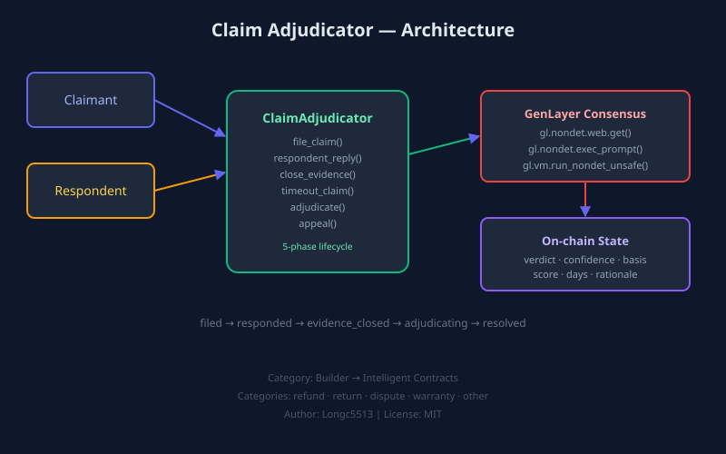

# Claim Adjudicator

Claim Adjudicator is a standalone **Intelligent Contract** primitive for
adversarial dispute resolution and claim adjudication on GenLayer.

It is built for builders who need a reusable contract that can:

- register a dispute claim with category classification
- compare claims against real policy and subject pages
- incorporate respondent counter-response before finalization
- resolve a final verdict through GenLayer-native consensus
- auto-resolve claims when respondents are silent (timeout)
- persist an on-chain adjudication outcome for downstream flows

This repo targets `Builder -> Intelligent Contracts`, not `Projects`. The focus
is a reusable primitive, meaningful GenLayer consensus, readable state design,
and reviewer-friendly documentation.

## Visual Overview



## Why This Fits Intelligent Contracts

This contract is not a thin wrapper or a learning-only exercise.

It exposes a reusable building block for:

- marketplace buyer protection
- merchant refund review
- return window disputes
- warranty claim resolution
- escrow release gating
- support workflow escalation

The core contract logic uses real GenLayer consensus behavior:

- `gl.nondet.web.get(...)` to fetch policy, subject, and evidence snapshots
- `gl.nondet.exec_prompt(...)` to generate a structured adjudication judgment
- `gl.vm.run_nondet_unsafe(...)` to compare leader and validator outcomes

The non-deterministic result materially affects contract state because the
final verdict, basis, match score, elapsed days, and resolution status
are persisted only after consensus succeeds.

## Contract Primitive

- Contract file: `contracts/claim_adjudicator.py`
- Contract name: `ClaimAdjudicator`
- Category target: `Builder -> Intelligent Contracts`

### Public Write Methods

- `file_claim(...)` — open a new dispute claim with escrow
- `respondent_reply(...)` — respondent submits counter-evidence
- `close_evidence(...)` — close the evidence collection period
- `timeout_claim(...)` — auto-resolve when respondent is silent
- `adjudicate(...)` — run AI-mediated consensus adjudication
- `appeal(...)` — appeal a denied verdict with new evidence
- `set_arbiter(...)` — owner changes the arbiter address

### Public View Methods

- `get_claim_json(...)` — full claim state as JSON
- `get_claim_ids()` — list all claim IDs
- `get_claim_count()` — total number of filed claims
- `get_phase(...)` — current lifecycle phase
- `latest_summary(...)` — compact status string
- `get_owner()` — contract owner address
- `get_arbiter()` — current arbiter address

## State Model

Each claim stores:

- claim id, title, category
- claimant and respondent addresses
- policy URL, subject URL, evidence URL
- facts and reason
- respondent reply and counter-evidence URLs
- phase, response deadline, evidence deadline, timeout deadline
- escrow amount and deposit status
- escrow settlement status and settlement round
- appeal count
- verdict, confidence, basis, rule match score, elapsed days, rationale
- resolved flag, initial verdict

This makes the primitive readable for both builders and reviewers.

## Claim Categories

- `refund` — monetary refund disputes
- `return` — product return eligibility
- `dispute` — general dispute resolution
- `warranty` — warranty claim adjudication
- `other` — any other claim type

## How Consensus Works

1. a claimant files a claim with policy, subject, and evidence URLs
2. a respondent reply URL can be added before evidence closes
3. `adjudicate(...)` fetches all public evidence snapshots
4. the contract asks the model for a structured adjudication judgment
5. `gl.vm.run_nondet_unsafe(...)` compares leader and validator outcomes
6. only the consensus-approved result is persisted on-chain

The structured result contains:

- `verdict`: `approved | denied | needs_review`
- `confidence`: `high | medium | low`
- `rule_match_score`
- `elapsed_days`
- `basis`
- `rationale`

## Real GEN Escrow Settlement

This contract uses real GEN token transfers for settlement:

- `file_claim(...)` is `@gl.public.write.payable` — claimant must send GEN with the transaction
- `appeal(...)` is also `@gl.public.write.payable` for denied claims — an appeal must post a fresh GEN escrow
- On resolution, `_Recipient(...).emit_transfer(...)` transfers the escrow:
  - `approved` → escrow returned to claimant
  - `denied` → escrow sent to respondent
  - `needs_review` → escrow returned to claimant (no fault)
- `timeout_claim(...)` returns escrow to claimant when respondent is silent
- after settlement, the current escrow round is marked as settled and cannot be paid again

### Appeal escrow safety

The appeal flow is explicitly escrow-safe:

- a denied claim can only be appealed after the previous escrow round has already been settled
- the previous escrow round is marked as settled on payout and its `escrow_amount` is zeroed out
- an appeal must post a fresh GEN escrow deposit
- the next adjudication can only settle that fresh appeal escrow, never the already-paid prior round

This is NOT internal accounting — real GEN moves on-chain.

## Timeout Auto-Resolution

If a respondent never replies and the timeout window expires, the claimant
can call `timeout_claim(...)` to auto-approve the claim. This prevents
unresponsive respondents from blocking resolution indefinitely.

## Use Cases

### 1. Marketplace refund disputes

Check whether a buyer complaint actually falls inside published return terms.

### 2. Warranty claim resolution

Gate a warranty payout based on the final eligibility verdict.

### 3. Merchant support escalation

Resolve policy-backed return disagreements using a shared on-chain outcome.

### 4. Escrow review primitive

Use the claim result as an input to downstream resolution or settlement logic.

### 5. Timeout-protected claims

Auto-resolve when the other party fails to respond within the deadline.

## Repository Structure

```text
claim-adjudicator/
|-- contracts/
|   `-- claim_adjudicator.py
|-- deploy/
|   `-- 001_deploy_claim_adjudicator.mjs
|-- docs/
|   |-- contract-design.md
|   `-- images/
|       `-- repo-architecture.svg
|-- examples/
|   `-- example-claims.md
|-- scripts/
|   `-- verify-contract.mjs
|-- src/
|   `-- claim-adjudicator-client.ts
|-- submission-pack/
|   |-- JUDGE-NOTES.md
|   `-- SUBMISSION-DESCRIPTION.md
|-- tests/
|   `-- submission-proof.test.mjs
|-- .gitignore
|-- LICENSE
|-- package.json
`-- README.md
```

## Builder Reading Path

1. `README.md`
2. `contracts/claim_adjudicator.py`
3. `src/claim-adjudicator-client.ts`
4. `docs/contract-design.md`
5. `tests/submission-proof.test.mjs`
6. `submission-pack/JUDGE-NOTES.md`

## Deploy Path

```bash
genlayer deploy --contract contracts/claim_adjudicator.py
```

### Live Bradbury Testnet Deployment

Updated deployment on **August 7, 2026** — fixes close_evidence lifecycle gap:

- Contract address: `0x5DD69058d3EDd6226908A87Cc584f26F60Cc9De9`
- Deployment tx: `0x256ded1ce2ff2ff7c32d0871f04dbde6dd0dee3c820dac021c5e2e8de56857a5`
- Explorer contract: `https://explorer-bradbury.genlayer.com/address/0x5DD69058d3EDd6226908A87Cc584f26F60Cc9De9`
- Explorer transaction: `https://explorer-bradbury.genlayer.com/tx/0x256ded1ce2ff2ff7c32d0871f04dbde6dd0dee3c820dac021c5e2e8de56857a5`

#### v2 fix: close_evidence deadline enforcement

Previously, `close_evidence` could be called on a claim still in the `filed`
phase before the response deadline expired, preventing the respondent from
using their promised response window. Now:

- When phase is `filed`, the response deadline **must** have passed before
  evidence can be closed (block-height check against `response_deadline`).
- When phase is `responded`, evidence can still be closed at any time
  (the respondent already replied).

## Minimal Client Integration

This repo includes a small builder-facing TypeScript helper:

```text
src/claim-adjudicator-client.ts
```

It shows how another builder can:

- connect a Studionet wallet
- deploy the contract
- file a dispute claim
- attach respondent reply
- auto-resolve via timeout
- resolve the final outcome
- read the stored claim back

## Verification

```bash
npm install
npm test
```

The proof tests verify:

- GenLayer-native non-deterministic primitives exist
- the contract exposes meaningful write and view methods
- consensus changes stored state
- the deploy path exists
- the client helper demonstrates reuse
- the README documents purpose and verification clearly

## Author

- Author: `Longc5513`
- GitHub: `https://github.com/Longc5513`

## License

MIT
